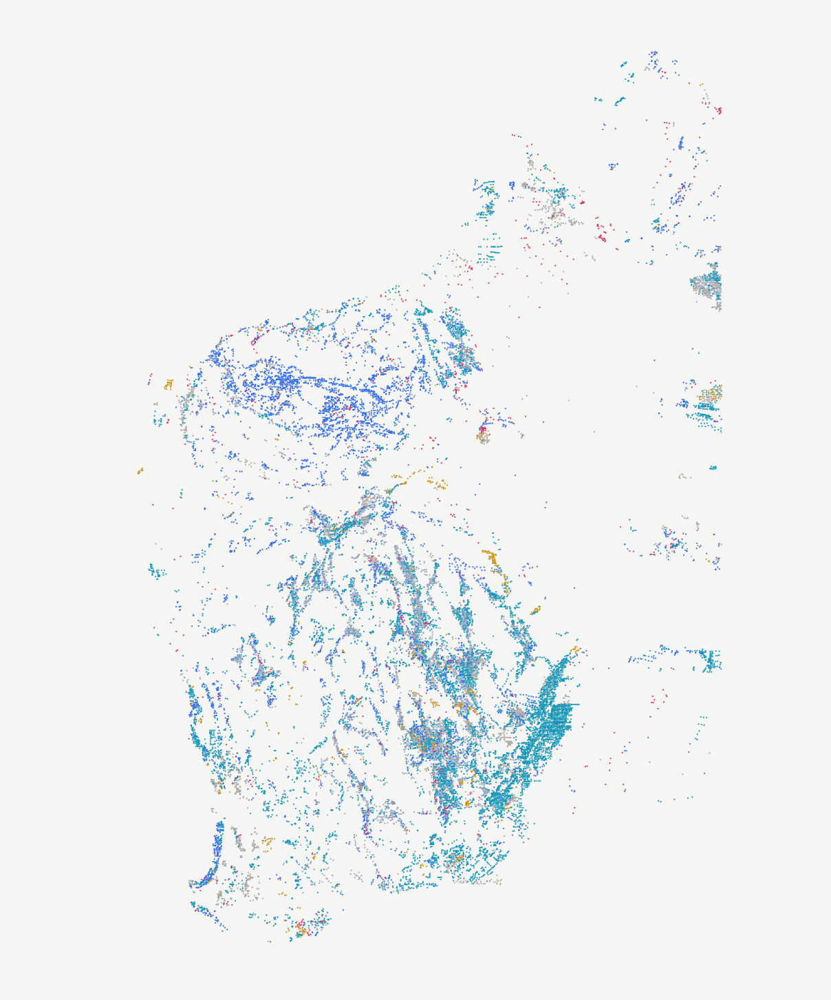

# wamex-explorer

Draw a polygon anywhere in Western Australia. Get a written history of everything ever done on that
ground — every drillhole, every exploration report, every company that tried and what they concluded.

Built on WA's free, public, CC BY 4.0 open-file exploration data:
**3.47 million drillholes** and **118,834 exploration reports** going back to 1970.

| File | What |
|---|---|
| `BUILD.md` | What to build, phased, with the honest risks |
| `DATA.md` | Verified API endpoints, schemas, record counts, licence, gotchas |
| `CLAUDE.md` | Project context, auto-loaded by Claude Code |
| `docs/` | **Learning-first documentation** — domain primer, glossary, verified research, architecture, concepts |

**Status:** **Phase 2 working, locally.** Draw an area anywhere in WA → "Save & share as
document" → a permalinked ground-history brief: exploration timeline, drilling summary,
commodity focus over time, what the record does not show, and every report with its
abstract, each cited to its A-number. Still no LLM: every sentence is a template filled
from a `GROUP BY`. Four pre-generated briefs for ground every WA geologist knows:
`/b/super-pit`, `/b/boddington`, `/b/tropicana`, `/b/mt-keith`.
See [docs/02-architecture/04-running-locally.md](docs/02-architecture/04-running-locally.md).

ℹ️ A commercial product (NextMaps) already sells polygon → cited ground history. This
project is **not** competing with it — it is the learning vehicle and a corpus-cleaning
effort (ADR-008). See [`docs/01-research/04-product-options.md`](docs/01-research/04-product-options.md).

Start at [`docs/README.md`](docs/README.md). Next: publish the cleaned corpus (Option 4), weekly refresh, deploy.

---

Based on Department of Mines, Petroleum and Exploration material, used under
[CC BY 4.0](https://creativecommons.org/licenses/by/4.0/).
